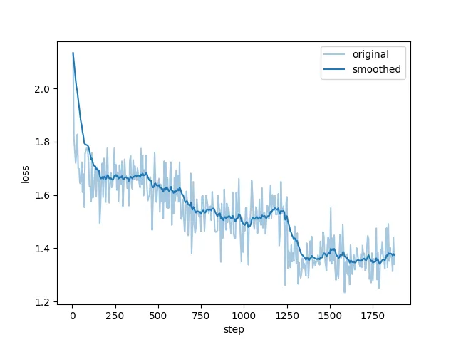
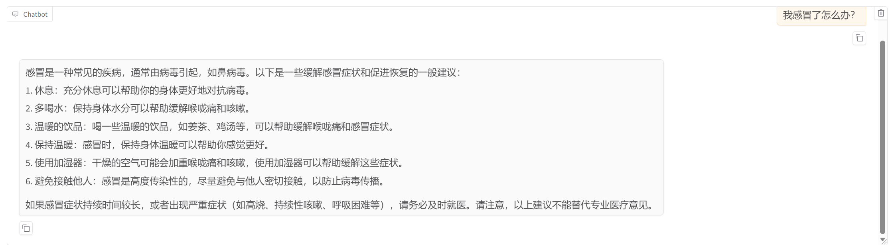
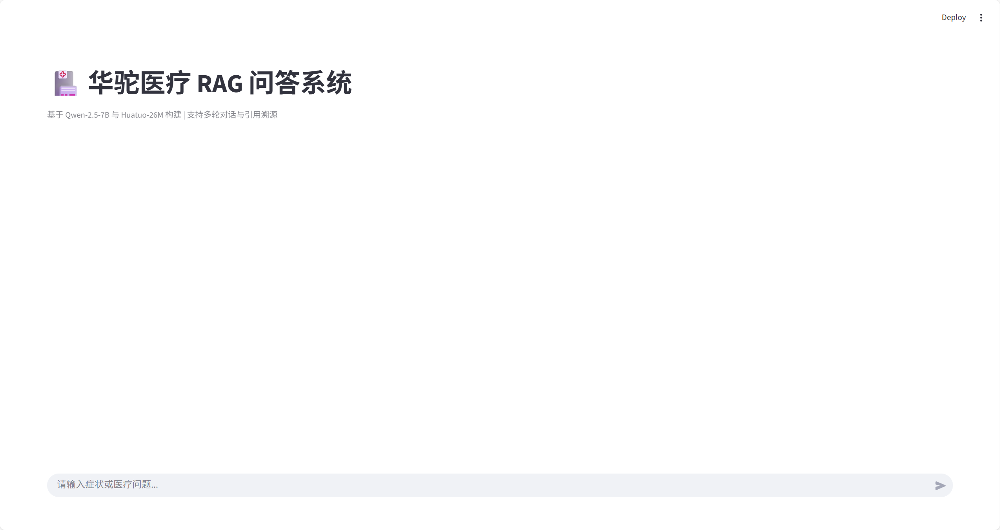
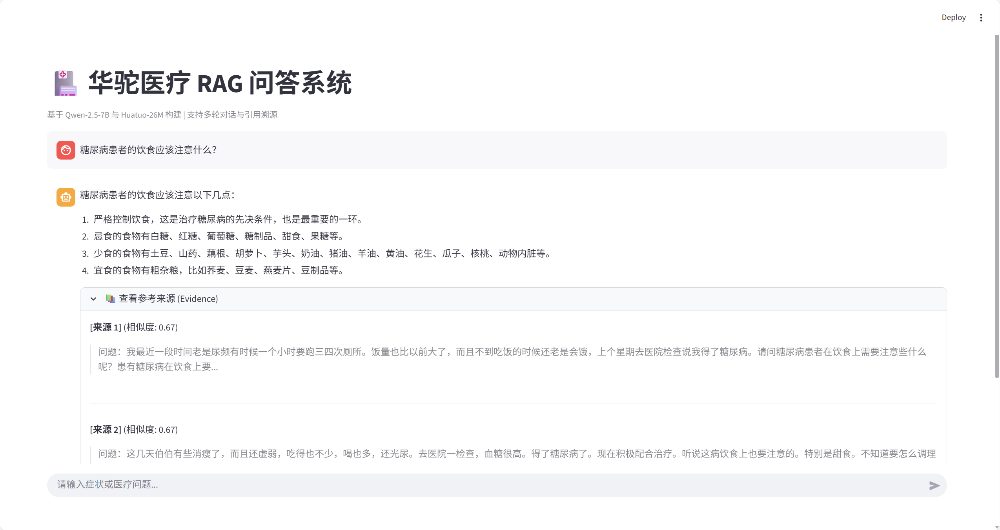

# Medical-RAG-System: 基于 Qwen2.5 与 Huatuo-26M 的医疗智能问答系统

## 项目概述

本项目构建了一个面向中文医疗领域的 **检索增强生成 (RAG)** 问答系统。针对通用大模型在医疗领域容易产生幻觉、缺乏专业知识的问题，本系统利用 **Huatuo-26M-Lite** 医疗问答数据集构建本地向量知识库，结合 **BGE-M3** 嵌入模型和 **Qwen-2.5-7B-Instruct** 大模型，实现了基于证据的专业医疗问答。

此外，本项目还引入了 **LoRA (Low-Rank Adaptation)** 微调技术，进一步提升了模型在医疗指令遵循和专业术语表达上的准确性，并使用 **DeepSeek-V3 API** 实现了自动化的客观评估。

## 数据来源与处理

本实验采用 **Huatuo-26M-Lite** 数据集。**Huatuo26M-Lite** 是基于 **Huatuo26M** 数据集精炼和优化的版本，经过多次净化处理和重写。它拥有更多的数据维度和更高的数据质量。

**来源：**[Huatuo26M-Lite](https://huggingface.co/datasets/FreedomIntelligence/Huatuo26M-Lite)

**数据量：**全量约 **17w+** 条问答对

为了适应任务需求，我们对原始数据进行了两种不同的处理：

1. **向量库数据 (RAG)**：

   - **处理逻辑**：将 `Question` 和 `Answer` 拼接为完整的语义块 (Chunk)。

   - **元数据提取**：保留原始问题作为 Metadata，便于检索后的引用溯源。

   - **清洗**：去除过短（<10字符）或包含乱码的无效数据。

2. **微调数据 (SFT)**：

   - **格式转换**：编写 `convert_data.py` 脚本，将数据转换为 **Alpaca 指令格式**：

     ```json
     {
       "instruction": "你是一名专业的医疗智能助手。请根据用户的问题，给出准确、专业且客观的医疗建议。",
       "input": item['question'],
       "output": item['answer']
     }
     ```

   - **采样**：随机抽取 1w 条高质量问答对用于 LoRA 训练。

## 方法

本项目采用经典的 RAG 架构，包含以下核心模块：

- **检索端 (Retriever)**：使用 **BGE-M3** 模型将医疗文档向量化，存入 **ChromaDB**。检索策略采用 Top-3 Dense Retrieval。
- **生成端 (Generator)**：基座模型为 **Qwen-2.5-7B-Instruct**。
- **微调策略 (Fine-tuning)**：使用 **LLaMA-Factory** 进行 LoRA 微调。

**硬件环境：**本项目租用AutoDL的算力资源，使用单张**NVIDIA GeForce RTX 4090 48GB**显卡进行模型微调。

**微调参数**：

- Learning Rate: 1e-5
- Epochs: 3.0
- LoRA Rank: 16, Alpha: 32
- Batch Size: 4

**评估指标：**

采用 **LLM-as-a-Judge** 范式，使用 **DeepSeek-V3 API** 作为客观裁判，评估以下指标：

1. **准确率 (Accuracy)**：回答是否符合医学事实。
2. **引用一致性 (Rouge-L)**：衡量生成内容与参考文档的文本重叠度（F1 Score 近似）。
3. **幻觉率 (Hallucination Rate)**：检测回答中是否包含参考文档未提及的额外信息。

## 实验结果

在包含 100 个随机抽样问题的测试集上进行了对比实验：

| 实验组                        | 准确率 (Accuracy) | 引用一致性 (Rouge-L) | 幻觉率 (Hallucination) |
| ----------------------------- | ----------------- | -------------------- | ---------------------- |
| **Baseline** (Qwen-2.5 + RAG) | 74%               | 0.3373               | 17%                    |
| **Optimized** (LoRA + RAG)    | 80%               | 0.4203               | 11%                    |

下图展示了 LoRA 微调过程中的 **Training Loss** 变化趋势：



下图展示了使用LLaMA-Factory自带的评估功能对基线模型和微调模型的测试，上方为基线模型，下方为微调模型：




## 问题分析

遇到的问题与解决方案：

**现象**：在某些检索失败的 Case 中，Base 模型能靠常识答对，但微调模型因为严格遵循“只看文档”，反而回答“不知道”。

**分析**：这虽然降低了单题的准确率，但对于医疗系统而言，**“不知道”远比“瞎编”更安全**。这种是提升系统可靠性的必要代价。

## 系统演示





## 总结与未来改进

1. **引入 Rerank (重排序)**：目前仅使用 BGE-M3 进行粗排，未来可引入 BGE-Reranker 对 Top-50 结果进行精排，解决“检索内容不相关导致模型拒答”的问题。
2. **混合检索 (Hybrid Search)**：结合关键词检索 (BM25) 和 向量检索，提升对专有名词（如罕见药名）的检索命中率。
3. **Agentic RAG**：将系统升级为 Agent，使其具备调用外部工具（如查询药品数据库 API）的能力，而不仅仅是查阅静态文档。